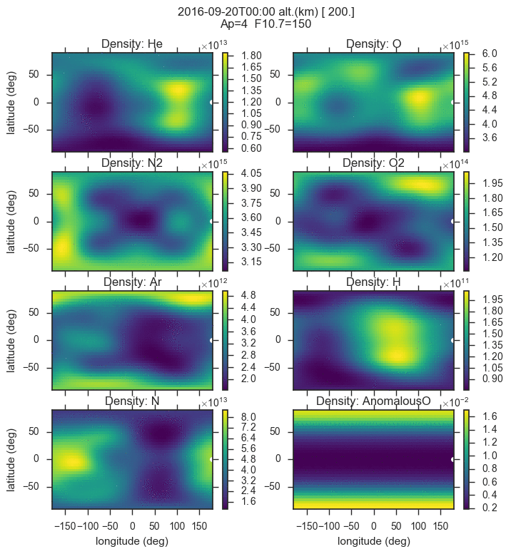

# MSISE-00 in Python

NRL MSISE-00 atmospheric model. 
Valid from altitude z = 0..1000 km.

The plot immediately below shows a slice at 200km on a world-wide grid.
The yellow ball represents the sun footprint on Earth.

## Install

-   Mac: `brew install gcc`
-   Linux: `apt install gfortran`
-   [Windows](https://www.scivision.co/windows-gcc-gfortran-cmake-make-install/)
    or use [Windows Subsystem for Linux](https://www.scivision.co/install-windows-subsystem-for-linux/).

And then:

    pip install -e .

## Examples

Write NetCDF4 output (HDF5 compatible) with command line argument `-w filename.nc`.

The data variables are 4-D (time, altitude, lat, lon), and are indexed like `atmos['N2']`

### Altitude Profile

at a single time:

    msis00 -t 2017-08-21T20:48 -c 40 -90

### Alt. profile time-range

with hourly time step (let me know if you want other options):

    msis00 -t 2017-08-21 2017-08-22 -c 40 -90

### Grid: time,lat,lon

This example takes several minutes, and generates the plots in the README:

    msis00

## Reference

* Original fortran [code](http://nssdcftp.gsfc.nasa.gov/models/atmospheric/msis/nrlmsise00/)
* 1200+ citations 2002 [paper](http://onlinelibrary.wiley.com/doi/10.1029/2002JA009430/pdf)
