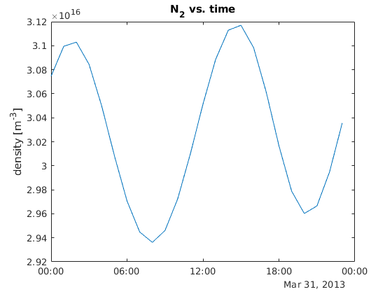

[](https://zenodo.org/badge/latestdoi/32971905)
[](https://travis-ci.org/scivision/msise00)
[](https://coveralls.io/github/scivision/msise00?branch=master)
[](https://ci.appveyor.com/project/scivision/msise00)
[](https://codeclimate.com/github/scivision/msise00/maintainability)
[](https://pypi.python.org/pypi/msise00)
[](http://pepy.tech/project/msise00)

# MSISE-00 in Python and Matlab

NRL MSISE-00 atmospheric model for Python &ge; 3.6, also accessible via Matlab.
Valid from altitude z = 0..1000 km.

The plot immediately below shows a slice at 200km on a world-wide grid.
The yellow ball represents the sun footprint on Earth.


This plot is from [Matlab](./tests/test_msise00_matlab.m) calling MSISE00:



## Install

This process is used for the Python and [Matlab](#matlab) access to MSIS.

1. Any Fortran compiler should work. Fortran compiler may be installed by

    * Mac: `brew install gcc`
    * Linux: `apt install gfortran`
    * [Windows](https://www.scivision.co/windows-gcc-gfortran-cmake-make-install/)

2. get MSISE00 and install Python package

    ```sh
    git clone https://github.com/scivision/msise00

    cd msise00

    python3 -m pip install -e .
    ```
3. one-time compilation step requires either CMake or Meson (details below).

    ```sh
    python3 -c "import msise00; msise00.build()"
    ```

### CMake install

* Linux: Download/build/install Cmake 3 using [cmake_setup.sh](https://github.com/scivision/cmake-utils)
* Mac: `brew install cmake` or use [.dmg installer](https://cmake.org/download/)
* Windows: use Windows [win64-x64 installer](https://cmake.org/download/)

### Meson install

```sh
python3 -m pip install meson
```

extract [Ninja](https://github.com/ninja-build/ninja/releases) and put it on your system path.

## Examples

MSISE00 can be used from the command line, as an imported module, and even from Matlab.

### import module

```python
import msise00
from datetime import datetime

atmos = msise00.run(time=datetime(2013, 3, 31, 12), altkm=150., glat=65., glon=-148.)
```

atmos is an [xarray.Dataset](http://xarray.pydata.org/en/stable/generated/xarray.Dataset.html) containing all the simulation output values.
`atmos` is 4-D: (time, altitude, lat, lon), and indexed like `atmos['N2']`


### Command Line

Write NetCDF4 output (HDF5 compatible) with command line argument `-w filename.nc`.

Simple examples include:

* AltitudeProfile.py
* TimeProfile.py
* Worldgrid.py


* Altitude Profile at a single time:
  ```sh
  MSISE00.py -t 2017-08-21T20:48 -c 40 -90
  ```
* Alt. profile time-range with hourly time step:
  ```sh
  MSISE00.py -t 2017-08-21 2017-08-22 -c 40 -90
  ```
* Grid: time,lat,lon: generates the plots in the README:
  ```sh
  MSISE00.py -t 2016-09-20 2016-09-21
  ```
* single time lat/lon can be plotted:
  ```sh
  MSISE00.py -t 2017-01-02T12
  ```

### Matlab

Matlab and GNU Octave users can seamlessly access Python modules, as demonstrated in
[AltitudeProfile.m](./matlab/AlitudeProfile.m) and
[msise00.m](./matlab/msise00.m).

1. Install MSISe00 by running [setup.m](./matlab/setup.m) from within Matlab or Octave
2. From Matlab, verify everything is working by from the `msise00/` directory:
   ```matlab
   runtests('tests')
   ```

### Time Utiliies

Time utilities of general interest include:

* `msise00.todatetime`
* `msise00.todt64`

## Fortran source

The MSISE00 Fortran source code may also be used directly.
We have provided for easy code reuse in
[CMake](./src/CMakeLists.txt)
and
[Meson](./src/meson.build)
projects.

## Reference

* Original fortran [code](https://ccmc.gsfc.nasa.gov/pub/modelweb/atmospheric/msis/)
* 1200+ citations 2002 [paper](http://onlinelibrary.wiley.com/doi/10.1029/2002JA009430/pdf)
